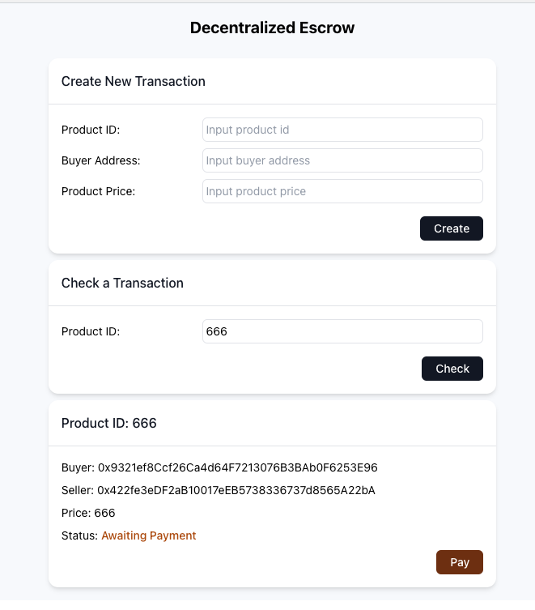
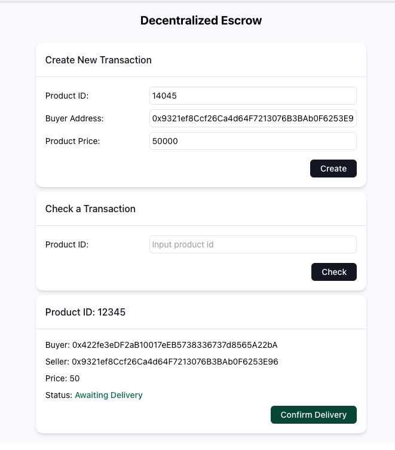
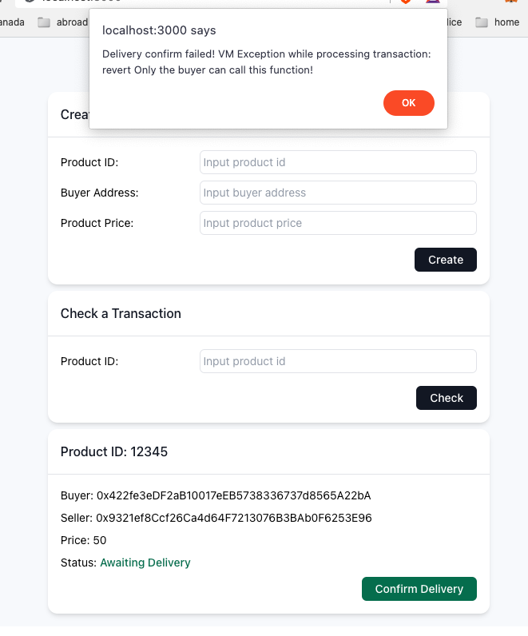
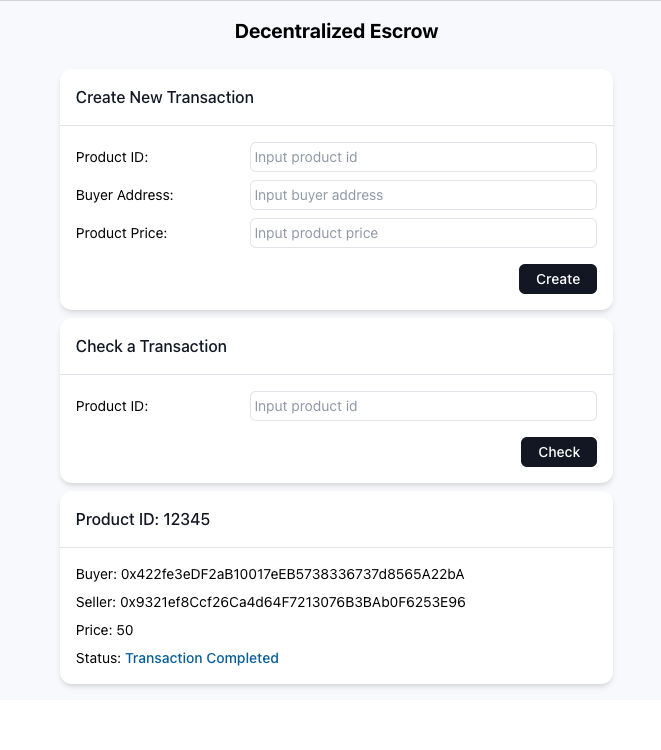

# Decentralized Escrow Application

Escrow dApp configured for Polkadot Network using Moonbeam Parachain (Moonbase Alpha TestNet).

### This project is part of Blockchain Platforms assignment

---

## Features

- Seller create new transaction by input the unique Product ID, the buyer's address, and the price
- Anyone can check the transaction detail by input the Product ID
- Buyer pay the transaction amount, the smart contract will hold the money as Escrow
  - Only buyer can pay and the status must be `Awaiting Payment`
- After receiving the item, buyer can confirm the delivery status. The smart contract will send the amount to the seller
  - Only buyer can confirm and the status must be `Awaiting Delivery`

## Pre-requisites

1. MetaMask wallet connected to Moonbase Alpha network:
   [How to setup](https://moonbeam.network/tutorial/how-to-connect-metamask-to-moonbeam/#:~:text=Connect%20to%20Moonbeam,rpc.api.moonbeam.network)
2. Get some token from the faucet: [Faucet](https://apps.moonbeam.network/moonbase-alpha/faucet/)
3. NodeJS >= 14
4. Yarn: `npm i -g yarn`

## How to run

1. Rename `.env.sample` file to `.env.`
2. Copy your account PrivateKey from MetaMask wallet to the env file and put it beside `MOONBASE_KEY=`
3. Install dependencies and compile smart contract: `yarn install`
4. Deploy the contract to the blockchain network: `yarn deploy`
5. Get the deployed contract address from the console and copy to the env file, put it beside `REACT_APP_CONTRACT_ADDRESS=`
6. Run the application: `yarn start`

## Technologies

- ReactJS
- TailwindCss
- Truffle box moonbeam
- Solidity

## Screenshots

### To-do

- Implement refund function on the front-end
